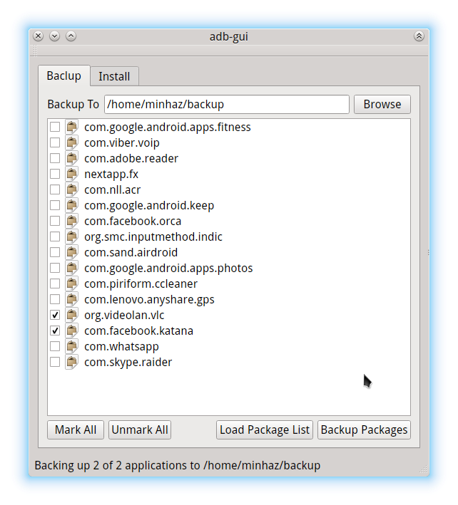

# adb-gui (Deprecated)
Graphical frontend of Android Debug Bridge (adb)

# Current Features
* List and backup APK to specific directory (works with Android 5.0 devices also)

# TODO
* App Data Backup
* Drag and Drop APK Install
* Drag and Drop File Copy
* Multi Device Support
* Reboot to Recovery or Fastboot mode
